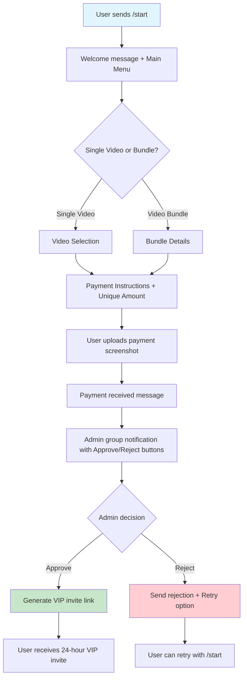

# Telegram VIP Bot 🤖

**Production-ready Telegram VIP subscription bot — Python + FastAPI + Supabase**

💎 **Myanmar-language UX** | 💳 **KBZPay payments** | 👥 **Admin group approval** | 🔗 **Unique invite links**

---

## 📋 Overview

A comprehensive Telegram bot solution for managing VIP subscriptions, video sales, and giveaways with Myanmar-language user interface. Built for production deployment with scalability, security, and maintainability in mind.

---

## ✨ Features

### 🤖 Core Bot Features
- 🇲🇲 **Myanmar-only UI** with inline button menus
- 💳 **KBZPay screenshot submission & verification** with unique payment amounts
- 👥 **Admin group approval** with ✅/❌ inline buttons
- 🔗 **One-use VIP invite link** (24h expiry) generated on approval
- 📨 **Admin ↔ User text forwarding** via reply threads for support tickets
- 🎬 **Video management system** for single purchases and bundles
- 🎁 **Giveaway system** drawing from unique channel-post commenters

### 🔐 Security & Management
- 🔒 **Admin ID whitelist** with comma-separated admin IDs
- 🛡️ **Duplicate approval guard** preventing double approvals
- ⚠️ **Banned user check** with admin notifications
- 📊 **Comprehensive logging** for all actions and payments
- ⏱️ **Rate limiting** to prevent spam

### 🚀 Production Ready
- 📁 **Supabase Storage** for screenshots (signed URLs, 5MB limit)
- 🔄 **Webhook mode (FastAPI)** — production-ready with background workers
- 🐳 **Multi-cloud deployment** (Google Cloud Run, Azure, Railway, Render, Fly.io)
- 📈 **Scalable architecture** with Redis support for multi-instance deployments
- 🏥 **Health monitoring** with database and bot connectivity checks

### 📱 User Experience
- 🎯 **Intuitive inline keyboard navigation**
- 🔄 **Session state management** for user flows
- ↩️ **Legacy callback support** for backward compatibility
- 📋 **Detailed payment instructions** with unique amounts
- ⏳ **Automatic session cleanup** for idle users

---

## 🚀 Quick Start

### 1️⃣ Install Dependencies
```bash
# Create virtual environment (optional but recommended)
python -m venv .venv

# Activate virtual environment
# On Windows:
.venv\Scripts\activate
# On macOS/Linux:
source .venv/bin/activate

# Install dependencies
pip install -r requirements.txt
```

### 2️⃣ Configure Environment
```bash
# Copy environment template
cp .env.example .env

# Edit .env with your values
# See "Environment Variables" section for detailed explanation
gedit .env  # or nano .env / code .env
```

### 3️⃣ Setup Supabase
1. **Create a Supabase project** at [supabase.com](https://supabase.com)
2. **Database Schema** - Go to **SQL Editor** → paste and run `schema.sql`
3. **Storage Setup** - Go to **Storage** → create a bucket named `screenshots` (private)
4. **Get Credentials** - Copy your **Project URL** and **Service Role Key** to `.env`

### 4️⃣ Telegram Bot Setup
1. **Create Bot** via [@BotFather](https://t.me/BotFather) → get `BOT_TOKEN`
2. **Admin Group** - Add bot to your **Admin Group** (must have "Send Messages" permission)
3. **VIP Channel** - Add bot to **VIP Channel/Group** as **Administrator** with "Invite Users via Link" permission
4. **Discussion Group** (for giveaways) - Link channel to a **discussion group** and add bot as admin
5. **Get Chat IDs** - Use @userinfobot to get negative chat IDs for groups
6. **Update `.env`** with all Telegram IDs and settings

### 5️⃣ Run Locally (Development)
```bash
# Terminal 1 — expose local port with ngrok
ngrok http 8000
# Copy the https URL → set as WEBHOOK_URL in .env

# Terminal 2 — start the bot server
python -m uvicorn main:app --reload --port 8000
```

**Alternative**: Use `python main.py` for direct execution

### 6️⃣ Production Deployment (Google Cloud Run)

⚠️ **Important**: Since the bot uses background queues to process webhooks concurrently, **Cloud Run must be configured with "CPU always allocated" (`--no-cpu-throttling`)**. If CPU is throttled after the webhook returns, the background tasks will freeze.

```bash
# 1. Build and deploy to Cloud Run
gcloud run deploy telegram-vip-bot \
  --source . \
  --allow-unauthenticated \
  --cpu 1 \
  --memory 512Mi \
  --no-cpu-throttling \
  --min-instances 1 \
  --max-instances 10

# 2. Set all Environment Variables in the Cloud Console
# Make sure to set REDIS_URL if you are scaling past 1 instance
# Make sure to grab the newly generated Service URL and update WEBHOOK_URL!
```

### 7️⃣ Other Deployment Platforms

**Railway / Render / Fly.io**
```bash
# Set all environment variables in the platform dashboard
# Start command:
uvicorn main:app --host 0.0.0.0 --port $PORT
```

**Azure Container Apps** (Detailed instructions below)

---

## 🗂️ Project Structure

```
telegram_vip_bot/
├── 📜 main.py               # FastAPI app + webhook endpoint
├── 🤖 bot_app.py            # PTB Application + handler registration
├── ⚙️ config.py             # Settings / env validation
├── 🗃️ schema.sql            # Supabase DB schema (run once)
├── 📦 requirements.txt      # Python dependencies
├── 📄 .env.example          # Environment variables template
├── 🐳 Dockerfile           # Container definition
├── ☁️ cloudbuild.yaml      # Google Cloud Build configuration
├── 🧪 tests/               # Test files
├── 📊 scripts/             # Utility scripts
└── Subdirectories:
    ├── 🗄️ db/              # Database operations
    │   ├── client.py        # Supabase client singleton
    │   ├── users.py         # User CRUD operations
    │   ├── videos.py        # Video management
    │   ├── orders.py        # Order processing
    │   ├── giveaways.py     # Giveaway management
    │   ├── giveaway_entries.py # Giveaway entries
    │   ├── logs.py          # Action logging
    │   └── storage.py       # Screenshot uploader
    ├── 💬 data/            # Content and UI
    │   ├── messages.py      # All Myanmar message templates
    │   ├── keyboards.py     # Inline keyboard builders
    │   └── bundle_manager.py # Bundle information management
    ├── 🎮 handlers/        # Telegram bot handlers
    │   ├── user_handler.py       # /start, video selection
    │   ├── payment_handler.py    # Screenshot upload flow
    │   ├── admin_handler.py      # Admin approval/rejection
    │   ├── admin_video_handler.py # Video management commands
    │   ├── broadcast_handler.py  # Broadcast messages
    │   ├── giveaway_handler.py   # Giveaway commands
    │   ├── join_request_handler.py # Join request handling
    │   ├── message_router.py      # Admin reply forwarding
    │   └── error_handler.py      # Global error handling
    └── ⚙️ utils/           # Utility modules
        ├── session.py         # Async in-memory session state
        ├── unique_amount.py   # Per-user unique payment amount
        ├── update_dispatcher.py # Webhook update dispatcher
        ├── retry.py           # Telegram API retry wrapper
        ├── rate_limiter.py    # User rate limiting
        ├── alerts.py          # Alert notifications
        └── db_async.py       # Async database utilities
```

---

## ⚙️ Environment Variables

| Variable | Required | Type | Default | Description |
|---|---|---|---|---|
| **Bot Configuration** | | | | |
| `BOT_TOKEN` | ✅ | String | - | Telegram bot token from @BotFather |
| `WEBHOOK_URL` | ✅ | String | - | Public HTTPS URL (no trailing slash) |
| `ADMIN_GROUP_ID` | ✅ | Integer | - | Admin review group chat ID (negative) |
| `VIP_CHANNEL_ID` | ✅ | Integer | - | VIP channel/group ID (negative) |
| `DISCUSSION_GROUP_ID` | ✅ | Integer | - | Discussion group ID linked to channel (negative) |
| `ADMIN_IDS` | ✅ | Comma-separated | - | Admin Telegram user IDs (e.g., "123456789,987654321") |
| `VIP_INVITE_LINK_PAID` | ❌ | String | - | Pre-generated VIP invite link for paid users |
| **Payment Settings** | | | | |
| `KBZPAY_PHONE` | ✅ | String | - | KBZPay phone number shown to users |
| `KBZPAY_NAME` | ✅ | String | "VIP Bot" | KBZPay account name shown to users |
| `USE_UNIQUE_AMOUNT` | ❌ | Boolean | `true` | Generate unique payment amounts per user |
| `MAX_FILE_SIZE` | ❌ | Integer | `5242880` | Max screenshot size in bytes (5MB default) |
| **Supabase Database** | | | | |
| `SUPABASE_URL` | ✅ | String | - | Supabase project URL |
| `SUPABASE_SERVICE_KEY` | ✅ | String | - | Supabase service role key |
| **Server Configuration** | | | | |
| `PORT` | ❌ | Integer | `8000` | Server port |
| `ADMIN_REVIEW_TIME_HOURS` | ❌ | Integer | `1` | Admin review timeout in hours |
| **Performance & Scaling** | | | | |
| `REDIS_URL` | ❌ | String | - | Redis connection URL for shared session state |
| `UPDATE_WORKERS` | ❌ | Integer | `8` | Background workers for webhook processing |
| `UPDATE_QUEUE_SIZE` | ❌ | Integer | `1000` | Max queued updates before 503 response |
| **Broadcast Settings** | | | | |
| `BROADCAST_BATCH_SIZE` | ❌ | Integer | `20` | Users per broadcast batch |
| `BROADCAST_BATCH_DELAY_SECONDS` | ❌ | Float | `0.4` | Delay between broadcast batches |

### 🎯 Production Tuning Notes

- **`WEBHOOK_URL`**: Use a stable domain (avoid temporary ngrok URLs in production)
- **`REDIS_URL`**: Required when running multiple app instances/workers for shared sessions
- **Performance**: Start with `UPDATE_WORKERS=8` and `UPDATE_QUEUE_SIZE=1000`, tune based on traffic
- **Broadcasting**: Adjust `BROADCAST_BATCH_SIZE` and `BROADCAST_BATCH_DELAY_SECONDS` for rate limiting
- **Security**: Keep `SUPABASE_SERVICE_KEY` secure as it has full database access
- **Chat IDs**: Always use negative IDs for groups/channels (use @userinfobot to verify)

---

## 🔄 User Flow Diagram



### 📝 Detailed User Journey

1. **Start** → User sends `/start` command
2. **Registration** → User registered in database, shown welcome message
3. **Selection** → User chooses between single video or bundle purchase
4. **Payment Instructions** → KBZPay details with unique payment amount
5. **Screenshot Upload** → User uploads payment confirmation
6. **Admin Review** → Screenshot forwarded to admin group for approval
7. **Decision** → Admin approves or rejects with inline buttons
8. **Outcome**:
   - ✅ **Approved**: User receives 24-hour VIP invite link
   - ❌ **Rejected**: User gets rejection message with retry button

---

## 💬 Commands List

### 👤 User Commands
| Command | Description | Usage Example |
|---|---|---|
| `/start` | Start the bot, register user, show main purchase menu | `/start` |
| *Any Text Message* | Forward text to Admin Group as **Support Ticket** | "Hello, I have a question" |

### 🛠️ Admin Commands (Must be in `ADMIN_IDS`)

#### 🎬 Video Management
| Command | Description | Usage Example |
|---|---|---|
| `/addvideo` | Add new video to single-purchase list | `/addvideo` → Follow prompts |
| `/deletevideo` | Delete videos from database | `/deletevideo` → Select from list |
| `/setvideolink` | Set Telegram link for specific video | `/setvideolink` → Select video → Enter link |
| `/setbundletext` | Update bundle purchase display text | `/setbundletext` → Enter new text |
| `/setchannelid` | Set channel ID for specific video | `/setchannelid` → Select video → Enter ID |

#### 📢 Broadcasting
| Command | Description | Usage Example |
|---|---|---|
| `/broadcast` | Broadcast to user segments | `/broadcast` → Select segment → Enter message |
| `/userstats` | View user statistics | `/userstats` → Shows counts |

#### 🎁 Giveaway Management
| Command | Description | Usage Example |
|---|---|---|
| `/giveaway_start` | Start giveaway for channel post | `/giveaway_start t.me/channel/123 5` |
| `/giveaway_draw` | Draw winners from giveaway | `/giveaway_draw t.me/channel/123` |
| `/giveaway_stats` | Show giveaway statistics | `/giveaway_stats t.me/channel/123` |
| `/giveaway_reset` | Reset drawn giveaway | `/giveaway_reset t.me/channel/123` |

#### 🛠️ Utility Commands
| Command | Description | Usage Example |
|---|---|---|
| `/cancel` | Cancel ongoing admin flow | `/cancel` → Cancels current operation |
| `/health` | Check bot health status | `/health` → Shows system status |

#### 📨 Support Handling
| Action | Description | How it Works |
|---|---|---|
| **Reply to Support Ticket** | Forward reply to user's DM | Reply to any message in Admin Group |
| **Reply to Payment** | Send message to payment submitter | Reply to payment screenshot |

### 🔄 Admin Workflow Notes
- All admin commands require user ID in `ADMIN_IDS`
- Interactive flows have cancellation with `/cancel`
- Broadcasts support segments: all users, paid users, no-order users, single buyers, bundle buyers
- Giveaways track unique commenters in discussion groups
- Video management maintains availability status

---

## 🚢 Deployment

### 🌐 Multi-Cloud Support

This bot supports deployment to multiple cloud platforms:

#### ✅ **Google Cloud Run** (Recommended)
```bash
gcloud run deploy telegram-vip-bot \
  --source . \
  --allow-unauthenticated \
  --cpu 1 \
  --memory 512Mi \
  --no-cpu-throttling \
  --min-instances 1 \
  --max-instances 10
```

⚠️ **Important**: Must use `--no-cpu-throttling` for background workers!

#### ☁️ **Azure Container Apps**
```bash
# Login to Azure
az login

# Build and push image to Azure Container Registry (ACR)
az acr build --registry YOUR_REGISTRY --image telegram-vip-bot:latest .

# Update Container App with new image
az containerapp update \
  --name telegram-vip-bot \
  --resource-group YOUR_RESOURCE_GROUP \
  --image YOUR_REGISTRY.azurecr.io/telegram-vip-bot:latest

# Check logs
az containerapp logs show \
  --name telegram-vip-bot \
  --resource-group YOUR_RESOURCE_GROUP \
  --type console \
  --tail 50
```

#### 🛤️ **Railway / Render / Fly.io**
```bash
# Set environment variables in platform dashboard
# Use this start command:
uvicorn main:app --host 0.0.0.0 --port $PORT
```

### 🐳 Docker Deployment
```bash
# Build Docker image
docker build -t telegram-vip-bot .

# Run container
docker run -p 8000:8000 --env-file .env telegram-vip-bot
```

---

## 🧪 Testing & Development

```bash
# Run tests
pytest

# Run specific test file
pytest tests/test_user_handler.py

# Run with coverage
pytest --cov=.

# Development with auto-reload
python -m uvicorn main:app --reload --port 8000
```

---

## 🔧 Maintenance & Monitoring

### 📊 Monitoring Endpoints

- `GET /` - Basic health check
- `GET /health` - Detailed health status with database/bot connectivity
- `GET /webhook` - Webhook probe endpoint

### 📈 Performance Monitoring
- **Queue utilization**: Monitor update queue usage
- **Worker status**: Check background worker activity
- **Database connectivity**: Regular Supabase connection checks
- **Bot status**: Telegram API connectivity verification

### 🔄 Database Maintenance
```sql
-- Check active users
SELECT COUNT(*) FROM users WHERE status = 'active';

-- Check pending orders
SELECT COUNT(*) FROM orders WHERE status = 'pending';

-- Clean old logs (example)
DELETE FROM logs WHERE timestamp < NOW() - INTERVAL '30 days';
```

---

## 📚 Additional Resources

### 🔗 Useful Links
- [Supabase Documentation](https://supabase.com/docs)
- [python-telegram-bot Documentation](https://python-telegram-bot.readthedocs.io/)
- [FastAPI Documentation](https://fastapi.tiangolo.com/)
- [Google Cloud Run Docs](https://cloud.google.com/run/docs)
- [Azure Container Apps Docs](https://learn.microsoft.com/en-us/azure/container-apps/)

### 🐛 Troubleshooting

#### Common Issues:
1. **Webhook not working**: Verify `WEBHOOK_URL` is correct and accessible
2. **Background tasks freezing**: Ensure `--no-cpu-throttling` on Cloud Run
3. **Redis connection issues**: Check `REDIS_URL` format and connectivity
4. **Supabase storage errors**: Verify bucket permissions and size limits
5. **Telegram API errors**: Check bot token and chat permissions

#### Log Locations:
- Application logs: Container logs in deployment platform
- Database logs: Supabase dashboard → Logs
- Error tracking: `handlers/error_handler.py`

---

## 📄 License & Support

This project is designed for production use with comprehensive documentation. For support:

1. Check the troubleshooting section
2. Review environment variable configuration
3. Verify deployment platform requirements
4. Monitor application logs

**Production URLs:**
- `telegram-vip-bot.delightfulhill-859bf6ae.eastasia.azurecontainerapps.io`
- `https://whitecatbot-684035743368.us-central1.run.app`

---

## 🚀 Getting Help

For additional assistance:
1. Review the detailed documentation above
2. Check the project structure for relevant modules
3. Examine the database schema in `schema.sql`
4. Review handler configurations in `bot_app.py`
5. Check environment variables against `.env.example`

Happy bot building! 🎉
